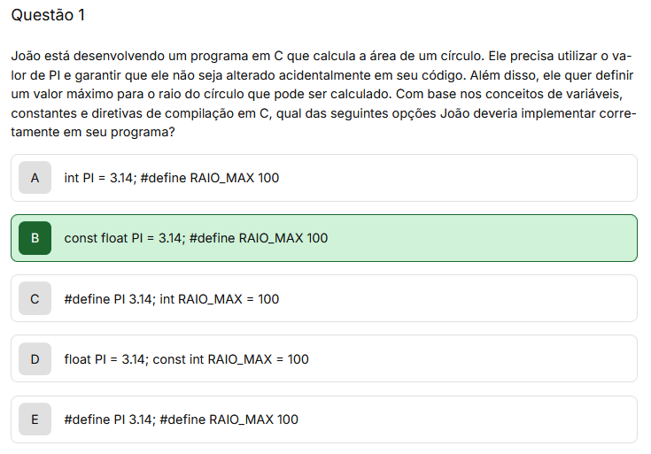
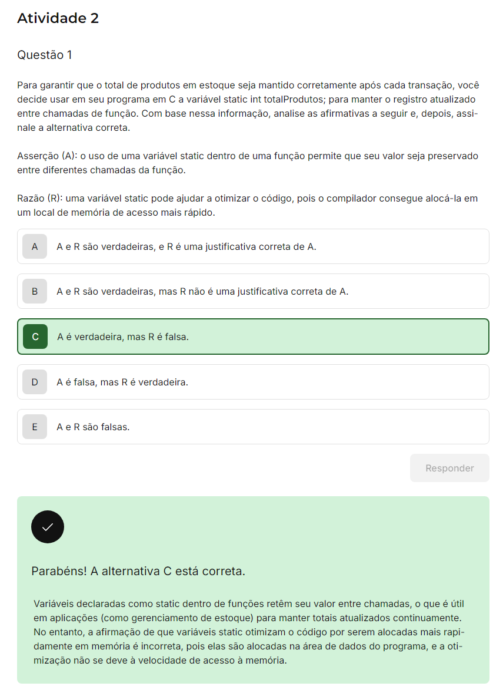

 

-> fazer 4 exercicios do `Tema 1`
-

Tema 1 - Bibliotecas e Apis Para Linguagem C
-

Atividade 1 - Questão 1
-

João está desenvolvendo um programa em C que calcula a área de um círculo. Ele precisa utilizar o valor de `PI` e garantir que ele não seja alterado acidentalmente em seu código. Além disso, ele quer definir um valor máximo para o raio do círculo que pode ser calculado. Com base nos conceitos de variáveis, constantes e diretivas de compilação em C, qual das seguintes opções João deveria implementar corretamente em seu programa?

**Constante PI: a declaração**
    
    const float PI = 3.14; 

assegura que o valor de PI seja tratado como uma constante, ou seja, um valor que não pode ser alterado depois de inicializado.     Diretiva RAIO_MAX:
    
    #define RAIO_MAX 100

define valor máximo para o raio que não precisa ser alterado e pode ser facilmente acessado em todo o código.

 

 

1. Linguagem C na programação de sistemas
   
Tipos básicos de dados, classes de armazenamento, especificadores e operadores

- tipos básicos de dados, como `int`, `char` e `float`, que definem a natureza das variáveis;
    - Inteiros (int), guarda numeros sem casas decimais;
    - Ponto flutuante (float, double), empregados em numeros com casas decimais, uteis em calculos de precisao como taxas de juros;
    - Caracteres (char), importantes em processamentos de texto, armazenam um unico caracter;
- classes de armazenamento, como `static` e `extern`, define a vida util de variaveis ou funções;
    - `auto`, usada para variaveis locais, desaparece apos o uso em um bloco ou função;
    - `static`, preserva seu valor, ideal manter estados, como contador de visitas;
    - `extern`, variavel definida externamente, comum em programas com multiplos arquivos;
    - `register`, variavel armazenada da CPU para acesso rapido, especialmente em loops frequentes; 
- especificadores, como `signed` e `unsigned`, ajusta o tamanho e alcance dos dados;
    - `unsigned int`, guarda apenas valores positivos, ideal para contagens;
    - `long`, aumenta a capacidade de armazenamento, adequado para numeros muito grandes;
- operadores e precedencia;
    - essencias para operacoes matematicas e logicas;
    - incluem aritmeticos, `+, -, *, /`;
    - logicos, `&&, ||, !`;
    - e de comparação, `==, !=, >, <`;
    - podemos contar com os parenteses tambem para alterar a ordem de avaliação, exemplo:
        - para priorizar a adição `(a+b)*c` garantindo que eles sejam somados antes da multiplicação.
        - expressoes combinam valores, variaveis e operadores para produzir novo valor com operadores de atribuição, como `=`, `+=`, e `*=`, que simplificam o codigo ao combinar aritmetica com atribuição;
  A precedencia define a ordem de avaliação das operações , onde os operadores de maior precedencia sao avaliados primeiro;

 

Atividade 2 - Questão 1
-

Para garantir que o total de produtos em estoque seja mantido corretamente apos cada transação, voce decide usar em seu programa em C a variavel `static in` totalProdutos; para manter o registro atualizado entre chamadas de função. Com base nessa informação, analise as afirmativas a seguir e, depois, assinale a alternativa correta.

Asserção (A): o uso de uma variavel `static` dentro de uma funcao permite que seu valor seja preservado entre diferentes chamadas da função.

Razao (R): uma variavel `static` pode ajudar a otimizar o codigo, pois o compilar compilador consegue aloca-la em um local de memoria de acesso mais rapido.

Bibliotecas e APIs para Linguagem C
-

- funcao `main()` ponto de partida para execução do codigo;

- alocação dinamica de memoria, permite que seu programa utilize a memoria de forma eficiente, alocando e liberando espaço conforme necessario;

- funçoes como `Malloc()` e `Free()`, sao essencias pra tarefa;

- controle de fluxo, outro pilar importante;
- estruturas condicionais como: `if`, `else`, laços de repetição como `for` e `while` permitem que o programa tomem decisoes e execute tarefas repetidamente aumentando a flexibilidade e a funcionalidade do codigo;

Alem disso o uso de bibliotecas expandi a capacidade do C, por exemplo:
- - bibliotecas para manipulação de datas e horários como a `time.h`, facilitam a realização de operaçoes complexas com datas;
- - para graficos, a API OpenGL, juntamente com a biblioteca GLUT possibilita a criação de interfaces graficas sofisticadas;

Por fim, a captura de eventos de teclado e mouse, é fundamental para o desenvolvimento de aplicaçoes interativas;

- - a `interação com o usuario` é um aspecto chave para muitos programas e jogos, tornando essa habilidade essencial para qualquer desenvolvedor;

 

Estruturas condicionais e de repetição
-

Ferramentas que permitem controlar o fluxo do programa e repetir tarefas de forma eficiente.
Facilita a resolução de problema pratico;

Como `if`, `else`, `switch-case`, `for`, `while` e `do-while` podem ser usados para automatizar e controlar tarefas repetitivas?

- são funções;
- instruções;

- - `if`, é a mais basica das estruturas condicionais, executa um bloco de codigo somente se uma condição especifica for verdadeira;
  - estrutura:

        if (condição) {
            // bloco a ser executado se verdadeira
        }

- - `else`, usamos quando queremos ter comportamento alternativo, caso a condição do `if` não seja true;

        if (condição) {
            // bloco a ser executado se verdadeira
        } else {
            // bloco a ser executado se falsa
        }

- - `if-else`, multiplas condições sequencialmente, usando as combinações, `if`, `else if`, e `else`;

        if (condição1) {
            // bloco executado se verdadeira
        } else if (condicao2) {
            // bloco executado se condição 1 falsa e 2 verdadeira
        } else {
            // bloco a ser executado se anteriores falsas
        }

- - `switch-case`, similar a uma serie de `if-else`, mas de forma mais limpa e organizada, é baseada em uma unica variavel;

        switch (expressao) {
            case valor1:
                // bloco valar1
                break;
            case valor2:
                // bloco valar2
                break;
            default:
            // bloco se cases anteriores não corresponder 
        }

-> Imagine implementar um software para uma maquina de venda automatica onde o user pode pressionar botoes para escolher um produto usando esta estrutura de repetição;